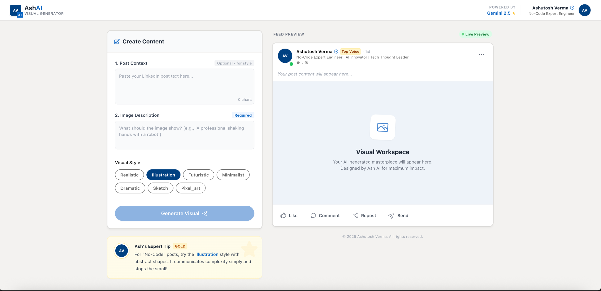
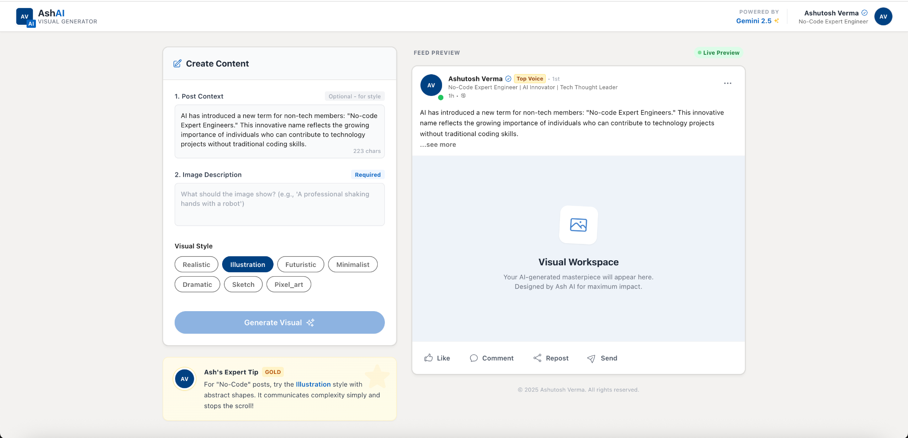
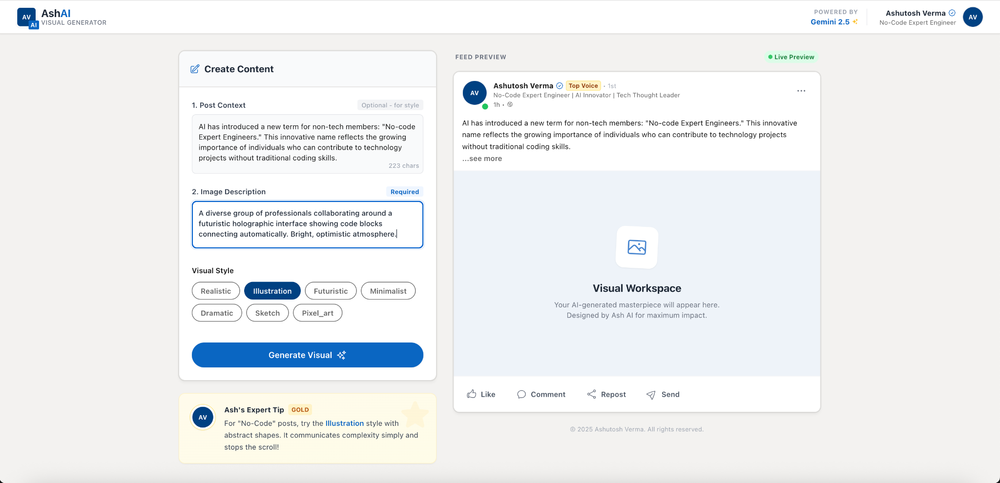
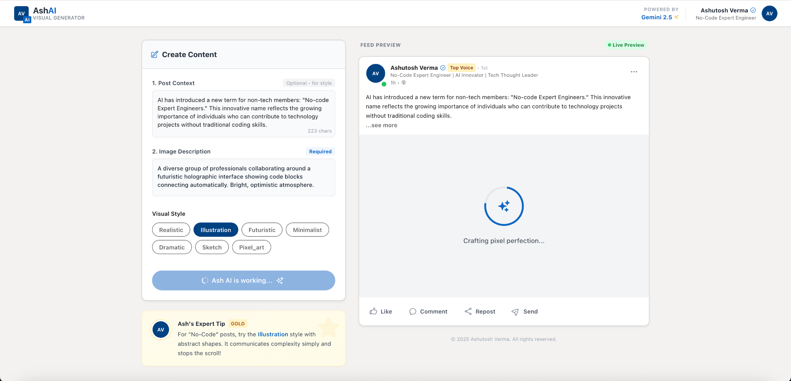
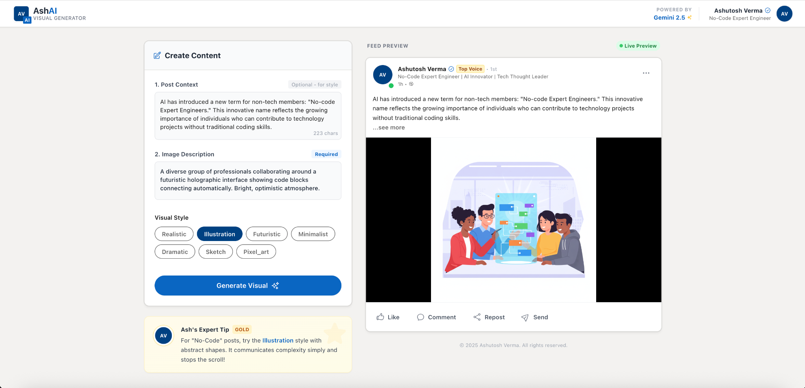
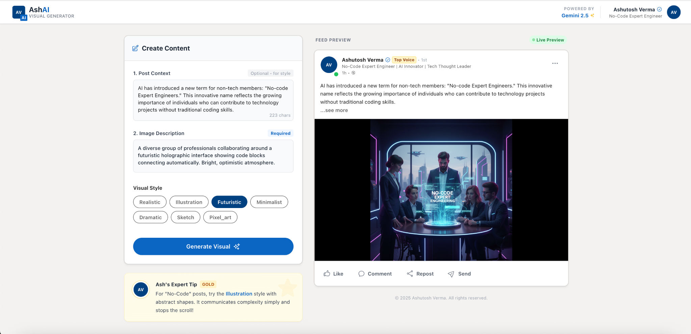
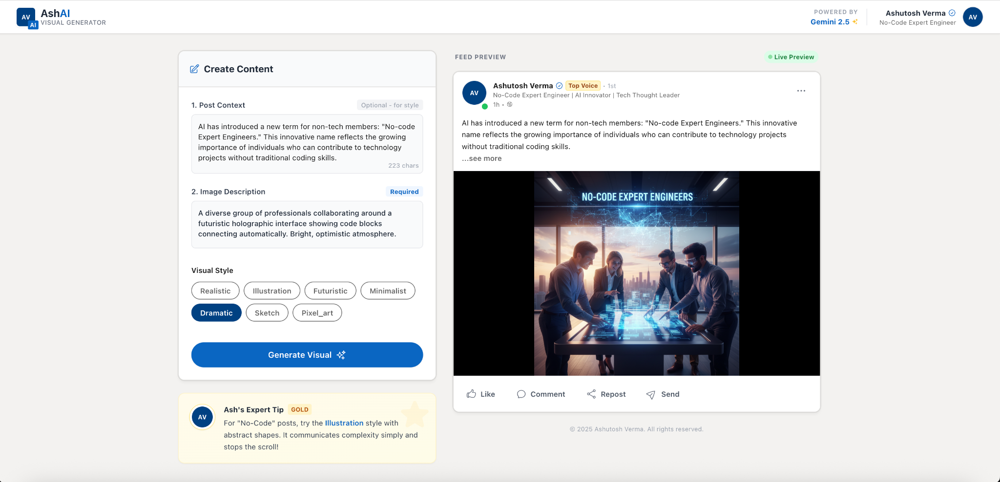

⭐ LinkedIn-Visuals-AI — AI Visual Generator for LinkedIn Posts

AI-powered, Gemini-enhanced visual generation tool designed for professionals to create stunning LinkedIn post visuals instantly.

🚀 Overview

LinkedIn-Visuals-AI is a sleek and powerful AI application built to help professionals, creators, and founders generate high-quality LinkedIn visuals with minimal effort.

Simply:

Paste your LinkedIn post content

Describe your image

Select a visual style

Generate AI-enhanced visuals with one click

This tool brings:

Smooth UI ✨

Live preview updates 🖼

Multiple aesthetic styles 🎨

Powered by Google Gemini AI ⚡

🎯 Features
🔹 ✨ One-Click Visual Generation

Create LinkedIn-ready visuals by simply describing what you want.

🔹 🎨 Multiple Visual Styles

Realistic

Illustration

Futuristic

Minimalist

Dramatic

Sketch

Pixel Art

🔹 🔍 Live Preview Mode

Preview the generated visual exactly as it would appear inside a LinkedIn feed.

🔹 🪄 Post Context + Image Description

Two-part input ensures visuals match both visual and messaging tone.

🔹 ⚡ Gemini 2.5 Integration

High-quality, consistent, captivating visuals — automated intelligently.

🔹 💡 Expert Tips Section

Built-in tips for improving post quality and visual appeal.

🛠 Tech Stack
Layer	Technology
Frontend	React + TypeScript
AI Model	Google Gemini 2.5
Styling	Tailwind / CSS
Build Tool	Vite
Components	Custom React Components
Integration	AI Studio / Gemini API
📸 App Screenshots

Here are real product screenshots demonstrating the UI and workflow of LinkedIn-Visuals-AI.

All images are displayed full-width for clarity and professionalism.

🏠 Home — Create Content Panel

🤖 Generated Visual — Dramatic Style

🎨 Illustration Style Preview

⚙️ Generating Visual (Progress Animation)

🌉 Visual Workspace (Empty State)

✏️ Input Editing UI

🏗 Live Post Preview (Full Layout)

⚙️ Installation
1️⃣ Clone the repository
git clone https://github.com/sirfashutosh/LinkedIn-Visuals-AI.git
cd LinkedIn-Visuals-AI

2️⃣ Install dependencies
npm install

3️⃣ Start development
npm run dev

🔌 Environment Setup

Create a .env file in the root:

VITE_GEMINI_API_KEY=your_key_here

Make sure you have a valid Google Gemini API key.

📦 Build for Production
npm run build

📘 How It Works

User enters Post Context (optional)

User describes the Image Description

Selects Style

Application sends request to Gemini image generation endpoint

The generated image appears in the Live Preview panel

User downloads or copies the visual for LinkedIn

🧭 Folder Structure
LinkedIn-Visuals-AI/
 ├── assets/
 │   └── screenshots/
 │       ├── screen1.png
 │       ├── screen2.png
 │       ├── ...
 │
 ├── components/
 ├── services/
 ├── App.tsx
 ├── package.json
 └── vite.config.ts

🚀 Future Enhancements

Download button for generated visuals

Social share feature

Templates for popular LinkedIn themes

Animate visuals (GIF / video output)

Save visual history in browser

👤 Author

Ashutosh Verma (Ash)
An AI Innovator
🔗 LinkedIn: https://linkedin.com/in/sirfashutosh

⭐ Support the Project

If this project helps you, please consider:
❤️ Starring the repo
🍴 Forking it
📢 Sharing it with creators
